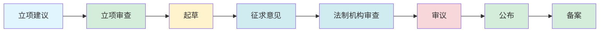
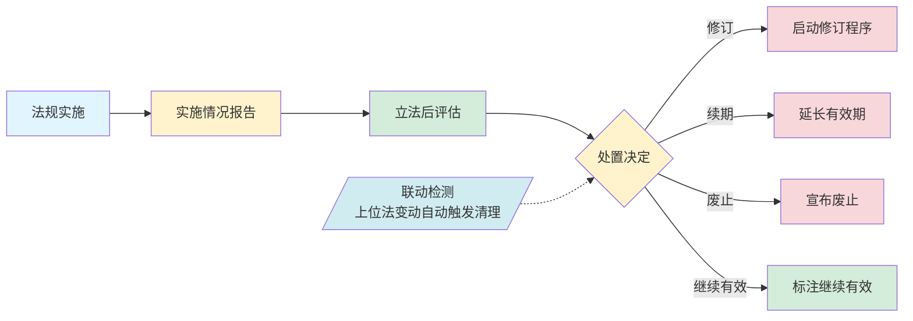
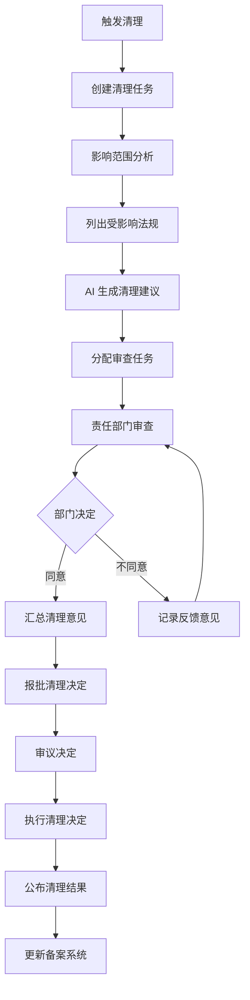
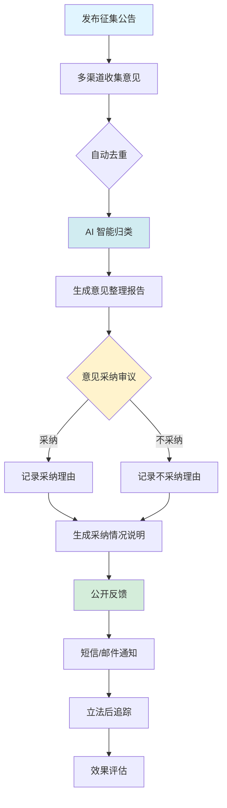

# 行政立法智能辅助平台 —— 需求说明书（法学生版）

> **面向读者**：法学院学生、法律实务人员
> **配套阅读**：详细技术设计见《行政立法智能辅助平台.md》
> **文档版本**：v2.0（法学生版 · 重写精简版）
> **编写日期**：2026 年 10 月

---

## 第一章 · 现存痛点

本章先回答"为什么要建这个平台"。在动手写任何功能之前，先看看行政立法实务中那些"让人头疼、靠人盯不住"的事。

### 1.1 立法工作为什么"难"

立法不是把条文写出来就行。一部行政法规或规章的诞生，往往要经历立项、起草、征求意见、法制审查、审议、公布、备案等多个环节，周期动辄一两年，参与方包括起草部门、法制机构、相关部门、专家学者、社会公众。

更复杂的是**后管理**：法规公布之后，还要做清理（哪些该废止、哪些该修改）、评估（实施效果到底好不好）。这些工作如果只靠人脑记忆、文件夹翻找，几乎不可能不出错。

### 1.2 八个核心痛点

平台的所有功能，都是为了解决下面这八个问题：

| 编号 | 痛点 | 现实情况 | 期望的解决方式 |
|------|------|----------|----------------|
| 1 | **各部门立法进度不透明** | 线下推进，"卡在哪一步"要靠打电话催 | 全流程线上可视化，每一节点都看得见 |
| 2 | **立法材料分散、检索难** | 资料散落在个人电脑、共享盘、邮件附件 | 集中资料库，关键词一搜就到 |
| 3 | **法规到期清理容易遗漏** | 靠工作人员记忆，到期没人提醒 | 系统自动扫描 + 提前预警 |
| 4 | **草案撰写耗时耗力** | 起草人"翻遍电脑找参考"，写作周期长 | AI 辅助起草 + 异地参考自动推送 |
| 5 | **人工审查标准不统一** | 不同审查员对同一条款看法不同 | 规则引擎统一标准 + AI 辅助发现疑点 |
| 6 | **法规间关联关系梳理难** | 上位法改了，下位法没人主动去查 | 自动梳理上下位法 + 联动提醒 |
| 7 | **立法后评估主观成分大** | 靠发问卷、开会讨论"好不好" | 对接执法平台真实数据，量化打分 |
| 8 | **公众参与渠道少、反馈散** | 群众提了意见，也不知道有没有人看 | 多渠道统一入口 + 意见自动归类 |

> **法学生小贴士**：把这八个痛点对照《行政法规制定程序条例》《规章制定程序条例》去看，会发现它们本质上都是"程序要求高、参与方多、文档量大"在实务中的具体表现。

---

## 第二章 · 总体目标

### 2.1 一句话目标

**建设一套覆盖行政立法"立项 → 起草 → 审查 → 公布 → 清理 → 评估"全生命周期的智能辅助平台。**

### 2.2 五大具体目标

1. **流程全线上**：从立法动议到公布备案，所有节点都搬到线上办理，进度随时可查
2. **资料一张网**：法律法规、草案、调研报告、专家意见统一归库，跨部门、跨地区可检索
3. **AI 帮起草**：写不出条文时，AI 给出"上位法要求 + 异地参考 + 标准格式"的草案初稿
4. **AI 帮审查**：条文与上位法是否冲突、引用法条是否失效、有没有越权立法，AI 先做一遍
5. **效果可量化**：法规实施好不好，用执法数据、复议诉讼数据、社会反馈数据说话

### 2.3 平台的法律依据

平台不是"创造"一套新的立法规则，而是把**已有法律法规明确规定的程序**数字化、可视化：

- 严格依据《行政法规制定程序条例》梳理行政法规流程
- 严格依据《规章制定程序条例》梳理部门规章、地方政府规章流程
- 依据《立法法》第 36 条落实"征求意见情况向社会公布"
- 依据《公平竞争审查制度实施细则》（国发〔2016〕34 号）落实公平竞争审查节点
- 依据中办发〔2010〕25 号落实社会稳定风险评估节点

> **法学生小贴士**：平台所做的，是把教科书中"立法程序"那一章变成可点、可看、可催、可查的电子流程。

---

## 第三章 · 需求概述

本章把"目标"翻译成具体的"需求项"——平台要做哪些事、做到什么程度。后续章节会逐项展开。

### 3.1 用户角色与需求概览

| 角色 | 典型身份 | 核心需求 |
|------|----------|----------|
| **立法工作人员** | 法规司、法制机构起草人员 | 高效起草、规范审查、按期完成 |
| **审查与决策人员** | 法制机构审核员、领导 | 快速发现合规问题、辅助决策 |
| **责任部门** | 起草部门、主管部门、协调部门 | 看到本部门承担的任务、按时反馈 |
| **社会公众** | 学者、企业、行业协会、普通群众 | 提交意见、查询进展、查看反馈 |

### 3.2 需求分类清单

| 类别 | 需求编号 | 需求描述 | 对应痛点 |
|------|----------|----------|----------|
| **流程管理** | FR-01 | 支持行政法规、部门规章、地方政府规章三类流程模板自动加载 | #1 |
| | FR-02 | 每个节点支持提交、退回、加签、协办、延期、终止等操作 | #1 |
| | FR-03 | 法定期限（30 日立项审查、30 日征求意见、15 日会签、30 日备案）自动计时 + 到期预警 | #1 |
| **资料中心** | FR-04 | 集中存储行政法规、规章、草案、调研报告、专家意见、案例 | #2 |
| | FR-05 | 支持关键词全文检索、按层级/地区/领域/年份多维筛选 | #2 |
| | FR-06 | 关联推荐：查看法规时自动推荐上位法、下位法、参照案例 | #2、#6 |
| **AI 起草** | FR-07 | 输入上位法条款，AI 自动提取需要细化的事项 | #4 |
| | FR-08 | 检索异地参考规章，AI 综合生成条文初稿 | #4 |
| | FR-09 | 草案版本管理：每次生成、修改都留版本快照，可对比改动 | #4 |
| **AI 审查** | FR-10 | 五类自动审查：与上位法冲突、越权立法、引用失效、条文重复、形式不规范 | #5 |
| | FR-11 | 审查结果分级标注（红/黄/蓝），附修改建议 | #5 |
| **智能清理** | FR-12 | 四类清理触发：上位法变动、定期扫描、到期预警、手动触发 | #3、#6 |
| | FR-13 | AI 对每部受影响法规给出"保留 / 修改 / 废止 / 合并"建议 | #3 |
| | FR-14 | 联动检测：上位法一变，下位法自动报警 | #6 |
| **实施评估** | FR-15 | 三维度评估：合法性（复议诉讼）、落实性（执法数据）、满意度（问卷投诉） | #7 |
| **意见征集** | FR-16 | 多渠道征集：Web 后台、H5、微信小程序、政务 APP、座谈会、书面征集 | #8 |
| | FR-17 | AI 自动去重 + 智能归类 + 生成意见整理报告 | #8 |
| | FR-18 | 反馈机制：意见采纳/不采纳均通过短信、邮件告知提交人 | #8 |
| **信息展示** | FR-19 | 对外门户：立法动态、法规文件库、政策解读、学术参考、数据大屏、订阅推送 | 增值 |

---

## 第四章 · 工作流程（mermaid 流程图）

本章用 4 个流程图说明平台要管住的"立法工作怎么流转"。

### 4.1 流程一：行政法规的"一生"（立项到备案）

> 依据《行政法规制定程序条例》。这是国务院制定行政法规时必须走的程序。

**各阶段要做什么事**：

| 阶段 | 关键动作 | 平台能帮什么 |
|------|----------|--------------|
| **立项建议** | 部门提出立法动议、填写申请表 | 模板化表格，关联上位法自动预填 |
| **立项审查** | 法制机构审核必要性、可行性，纳入年度计划 | 流程时限自动计时（30 日内必须答复） |
| **起草** | 成立起草小组、调研、撰写草案、起草说明 | AI 根据上位法 + 异地参考生成初稿；自动记录版本 |
| **征求意见** | 公开征求意见 30 日，可同时开座谈会、专家论证 | 多渠道发布 + 自动汇总 + 自动归类 |
| **法制机构审查** | 出具合法性、可行性、合理性、可控性审查报告 | 规则引擎标出疑点 + AI 给出修改建议 |
| **审议** | 国务院常务会议审议 | 提交材料一键打包，会后修改对比 |
| **公布** | 总理签署国务院令、刊登国务院公报 | 公布材料自动归档到法规库 |
| **备案** | 30 日内向全国人大常委会备案 | 备案时限提醒，备案后状态置"已备案" |

### 4.2 流程二：部门规章与地方政府规章的"一生"

> 依据《规章制定程序条例》。与流程一基本一致，主要差别在于审议机关和备案机关不同。

**两类规章的差异点**（法学生要特别注意）：

| 差异点 | 部门规章 | 地方政府规章 |
|--------|----------|--------------|
| 审议机关 | 部门部务会议 | 本级政府常务会议 |
| 公布形式 | 部门首长签署命令 | 省长 / 市长签署命令 |
| 备案机关 | 国务院 | 国务院（地方政府规章） 省级人大常委会（较大的市制定时） |

> **法学生小贴士**：从程序法角度看，《行政法规制定程序条例》比《规章制定程序条例》多了一个"社会稳定风险评估"环节（仅针对重大利益调整的行政法规）。平台会把两类流程都做成**可配置的流程模板**，新建立法项目时按类型自动加载。

### 4.3 流程三：法规公布之后还要做什么（立法后管理）

> 法规公布不是结束——"立"只是开始，后面的"评""清"才是平台要重点解决的事。

**评估与清理的触发点**（法学生要理解四个时机）：

| 评估 / 清理的时机 | 触发条件 | 谁来做 |
|--------------------|----------|--------|
| **实施 1 年评估** | 法规实施满 1 年 | 起草部门提交自评 |
| **届满评估** | 法规 5 年有效期届满前 | 法制机构组织评估 |
| **年度集中清理** | 每年一次的例行清理 | 法制机构牵头 |
| **联动清理** | 上位法被修改 / 废止 | 系统自动生成清理任务 |

### 4.4 流程四：清理任务怎么流转

> 当一项清理任务被触发后，从创建到公布清理决定的完整工作流。

> **法学生小贴士**：清理不是简单的"删旧法"。一次清理可能产生四种处置决定——**保留、修改、废止、合并**。平台对每一种处置都给出 AI 建议，最终由人工审定。

---

## 第五章 · 需求功能点

按"做什么 / 能解决什么 / 怎么用"三个维度，对每个功能点做简要说明。详细设计见第六章。

### 5.1 功能点总览

| 编号 | 功能点 | 所属模块 | 对应需求 |
|------|--------|----------|----------|
| FP-01 | 立法项目创建 | 模块一·全流程管理 | FR-01 |
| FP-02 | 流程节点可视化追踪 | 模块一·全流程管理 | FR-01、FR-02 |
| FP-03 | 法定期限自动预警 | 模块一·全流程管理 | FR-03 |
| FP-04 | 资料集中归库 | 模块二·资料管理 | FR-04 |
| FP-05 | 智能检索与关联推荐 | 模块二·资料管理 | FR-05、FR-06 |
| FP-06 | AI 起草初稿 | 模块三·AI 起草 | FR-07、FR-08 |
| FP-07 | 草案版本管理 | 模块三·AI 起草 | FR-09 |
| FP-08 | 五类自动审查 | 模块四·AI 审查 | FR-10、FR-11 |
| FP-09 | 清理任务四类触发 | 模块五·智能清理 | FR-12 |
| FP-10 | AI 清理建议 | 模块五·智能清理 | FR-13 |
| FP-11 | 联动检测 | 模块五·智能清理 | FR-14 |
| FP-12 | 三维实施评估 | 模块六·实施评估 | FR-15 |
| FP-13 | 多渠道意见征集 | 模块七·意见征集 | FR-16 |
| FP-14 | 意见自动归类与反馈 | 模块七·意见征集 | FR-17、FR-18 |
| FP-15 | 对外信息门户 | 模块八·信息展示 | FR-19 |

### 5.2 功能点优先级

| 优先级 | 功能点 | 备注 |
|--------|--------|------|
| **P0 必须** | FP-01 ~ FP-05、FP-08、FP-09、FP-15 | 基础流程 + 检索 + 规则审查 + 清理 + 对外 |
| **P1 重要** | FP-06、FP-07、FP-10、FP-11、FP-13 | AI 起草与清理、意见征集 |
| **P2 增值** | FP-12、FP-14 | 评估（需对接外部数据）、意见反馈闭环 |

---

## 第六章 · 功能模块详细设计

平台共规划 **8 个功能模块**。每个模块说明"做什么""能解决什么痛点""怎么用"。

---

### 模块一：行政立法项目全流程管理

**解决痛点**：#1（进度不透明）、#2（材料分散）

**模块做什么**：

把原本散落在各起草部门、靠"打电话催"的立法流程，统一搬到线上：

- **建项目**：选择要立的法是行政法规 / 部门规章 / 地方政府规章，平台自动加载对应的流程节点
- **看进度**：领导打开平台就能看到"现在卡在哪一步、谁负责、还剩几天"
- **做操作**：每个节点支持提交、退回、加签、协办、延期、终止等操作
- **挂资料**：每个节点该交什么材料，平台有清单和模板
- **做预警**：立项审查 30 日、征求意见 30 日、备案 30 日…… 法定期限前自动提醒

**法学生能怎么用**：

以法学院学生实习视角看，本模块就是**立法全流程的"活地图"**——你可以登录平台（只读权限）查看任一立法项目目前进展到哪一步、经历了哪些节点、各节点的负责人和办理时间。

**法定期限一览（法学生要记牢）**：

| 节点 | 法定期限 | 法规依据 |
|------|----------|----------|
| 立项审查 | 30 日 | 《行政法规制定程序条例》第 8 条 / 《规章制定程序条例》第 10 条 |
| 部门会签 | 15 日 | 《行政法规制定程序条例》第 11 条 / 《规章制定程序条例》第 13 条 |
| 征求意见 | 30 日 | 《行政法规制定程序条例》第 14 条 / 《规章制定程序条例》第 16 条 |
| 部门协调 | 30 日 | 《行政法规制定程序条例》第 15 条 / 《规章制定程序条例》第 17 条 |
| 备案 | 30 日 | 《行政法规制定程序条例》第 23 条 / 《规章制定程序条例》第 26 条 |

---

### 模块二：立法资料管理（立法资料库）

**解决痛点**：#2（材料分散、检索难）

**模块做什么**：

把"立法相关的所有材料"集中到一个**可检索的资料库**：

- **资料类型**：行政法规、部门规章、地方政府规章原文；历史草案；调研报告；专家意见；典型案例
- **检索能力**：关键词全文检索、按层级/地区/领域/年份筛选
- **关联推荐**：看一部法规时，自动推荐"上位法""下位法""参照的案例""类似制度"
- **个人工具**：收藏、批注笔记——你做研究时的"立法笔记"
- **版本管理**：同一条目多版本并存，保留修改历史

**法学生能怎么用**：

这相当于**法学院的"立法文献数字图书馆"**。在写学年论文、毕业论文时，你可以通过：

- 关键词搜索快速找到所有相关法规
- 关联推荐找到"还有哪些我没注意到的法源"
- 收藏 + 笔记做自己的研究积累

---

### 模块三：行政立法自动生成（AI 起草助手）

**解决痛点**：#4（草案撰写耗时耗力）

**模块做什么**：

当起草人需要写一部执行上位法的地方政府规章时，平台可以**先给出一版可用的初稿**：

- **拆上位法**：输入上位法条款，AI 自动分析"哪几条需要地方细化"
- **找参考**：根据细化事项，平台自动去其他省市已发布的规章里找类似条款
- **生草案**：综合上位法要求 + 异地参考 + 标准立法格式，AI 生成条文初稿
- **存版本**：每次生成、每次人工修订，都留版本快照，可对比改动
- **给模板**：自动按"章 → 节 → 条 → 款 → 项"的立法格式排版

**AI 起草流水线（法学生版图解）**：

**法学生能怎么用**：

实习时如果被分到"协助起草"任务，可以在平台输入课题相关的上位法条款，让 AI 给出多份初稿，再由你根据本地实际修改——这相当于**把"查资料 + 拼格式"这种机械活外包给 AI**，把精力放在真正考验法律素养的"制度设计"上。

---

### 模块四：行政立法智慧审查（AI 审查助手）

**解决痛点**：#5（人工审查标准不统一）

**模块做什么**：

把一份草案上传给平台，平台会按既定规则和 AI 模型做**五类自动审查**：

| 审查类型 | 检查什么 | 标注颜色 | 处理方式 |
|----------|----------|----------|----------|
| **与上位法冲突** | 草案条款是否与上位法实质性矛盾 | 红色 | 标"违反上位法第 X 条" |
| **越权立法** | 是否设定了超出制定权限的事项 | 红色 | 标"超越法定权限" |
| **引用失效法条** | 引用的法条是否已被废止或修改 | 黄色 | 提示"该条已失效/修改" |
| **条文重复** | 与本文件或其他文件高度相似 | 黄色 | 列出相似条文来源 |
| **形式不规范** | 条文序号、引用格式、语言冗杂 | 蓝色 / 灰色 | 给出正确格式示例 |

**法学生能怎么用**：

这是法学院学生**学以致用最好的训练场**——AI 标出疑点后，审查员或实习生要判断：

- 这条是不是真的与上位法冲突？
- 这个引用到底是不是失效了？
- 标"重复"的两条规范是否实质相同？

**判断的过程，就是对立法学、行政法学的实践训练**。

---

### 模块五：行政立法智能清理

**解决痛点**：#3（到期清理容易遗漏）、#6（法规间关联关系梳理难）

**模块做什么**：

清理是行政立法"后管理"中最复杂的一块。平台把清理拆成**四类触发、五步流程**：

**四类触发**：

| 触发类型 | 触发时机 | 优先级 |
|----------|----------|--------|
| **上位法变动** | 上位法被修改 / 废止 / 解释 | 高 |
| **定期扫描** | 法规施行满 3 年、5 年，或年度集中清理 | 中 |
| **到期预警** | 法规有效期届满前 6 个月 | 中 |
| **手动触发** | 部门申请或专项主题清理 | 低 |

**五步流程**：

1. **影响范围分析**：上位法变了，自动列出"哪些下位法受它影响"
2. **清理建议生成**：AI 对每部受影响法规给出"保留 / 修改 / 废止 / 合并"建议
3. **责任部门审查**：把建议分给各部门核实
4. **汇总与报批**：形成清理决定，报相应机关审批
5. **公布与更新**：清理结果向社会公布，并更新到法规库

**建议生成规则（法学生要理解"为什么这样建议"）**：

| 建议类型 | 什么时候给出 | 评估依据 |
|----------|--------------|----------|
| **保留** | 上位法未实质修改 | 影响程度轻微、历史使用正常 |
| **修改** | 上位法条款被修订，或社会反馈强烈 | 影响中等、需配套修订 |
| **废止** | 上位法被废止，或内容已被新法替代 | 影响完全覆盖、极少使用 |
| **合并** | 多部规章内容交叉 | 体系化整合需要 |

**清理的联动检测（亮点功能）**：

这是平台最有价值的特色——**上位法一变，下位法自动报警**。

例如：某省制定的《XX 实施办法》是依据国家《XX 条例》制定的。当国家《XX 条例》被全国人大修改后，平台会在几小时内自动识别出"该省实施办法可能需要配套修改"，并向法制机构发送提醒，无需人工去查"哪些下位法要跟着改"。

---

### 模块六：行政立法智能评估

**解决痛点**：#7（评估主观成分大）

**模块做什么**：

法规实施之后"好不好、效果怎么样"？平台用**三个维度**量化评估：

| 评估维度 | 数据来源 | 含义 |
|----------|----------|------|
| **合法性** | 行政复议、行政诉讼 | 法规被复议、诉讼的情况，反映是否被依法遵守 |
| **落实性** | 行政执法平台（执法量、处罚量） | 法规是否被实际执行到位 |
| **满意度** | 问卷调查、投诉数据 | 社会公众对法规实施的感受 |

**评估的核心创新是"用客观数据代替主观感觉"**——不再仅靠"开几个座谈会、发几份问卷"得出"实施良好"这种结论。

**法学生能怎么用**：

法学院做"立法后评估"课程作业时，往往苦于找不到真实数据。平台可（按权限）开放部分评估结果数据，让学生看到：

- 某部法规实施后，执法量上升还是下降了？
- 行政复议纠错率是多少？
- 公众投诉集中在哪些条款？

这些都是**法学实证研究**的珍贵素材。

---

### 模块七：行政立法意见征集

**解决痛点**：#8（公众参与渠道少、反馈散）

**模块做什么**：

把"面向社会征求意见"这件事从"在政府网站挂个 PDF"升级为**多渠道统一管理**：

**征集渠道**：

| 类型 | 渠道 | 适用场景 |
|------|------|----------|
| **线上** | Web 管理后台 | 内部工作人员发布、汇总 |
| | H5 公众页面 | 群众扫码进入提交意见 |
| | 微信小程序 | 移动端随时提交 |
| | 政务 APP | 政务用户使用 |
| | 人大官网 | 与人大网同步公告 |
| **线下** | 立法基层联系点 | 基层代表意见收集 |
| | 座谈会 | 重点领域专题征集 |
| | 书面征集 | 部门、单位来函 |
| | 来信来访 | 传统渠道手工录入 |

**征集后的智能处理**：

**意见分类体系（法学生要看懂"意见被归到哪一类"）**：

| 一级分类 | 二级分类 | 典型意见举例 |
|----------|----------|--------------|
| **合法性意见** | 与上位法冲突 / 超越权限 / 违反程序 | "这条规定与《XX 法》不一致" |
| **合理性意见** | 制度设计不合理 / 处罚力度不当 / 范围过宽或过窄 | "罚款金额过高，建议降低" |
| **可行性意见** | 实施条件不具备 / 执行成本过高 / 配套措施缺失 | "基层人手不足，难以落实" |
| **操作性意见** | 表述不清 / 逻辑矛盾 / 程序繁琐 | "第 X 条第 Y 款有歧义" |
| **其他** | 文字表述 / 格式规范 / 建议类 | "错别字" |

**法学生能怎么用**：

法学院学生是天然的"意见贡献者"——课堂上分析过的立法草案、模拟立法时提出的意见，都可以通过 H5 或小程序提交到对应法规的意见征集通道。提交后：

- 你的意见会被自动去重（避免重复）
- 会被 AI 归类到合适的主题
- 处理结果会通过短信 / 邮件反馈给你
- 立法后评估时，你的意见是否被采纳会被检验

---

### 模块八：立法信息展示（对外门户）

**解决痛点**：让"立法"这件事对政府内部、对学术界、对社会公众都**可见、可查、可订阅**

**模块做什么**：

| 功能 | 内容 |
|------|------|
| **立法动态** | 展示最新立法新闻、政策解读、领导讲话 |
| **法规文件库** | 按"中央 / 省 / 市"和"法规 / 规章"多维度浏览 |
| **政策解读** | 重要法规配套的解读文章 |
| **学术参考** | 立法研究论文摘要（可对接知网、万方） |
| **数据大屏** | 立法数量、地区分布、领域分布的可视化 |
| **订阅推送** | 订阅"某领域 + 某地区"的立法动态，定期推送 |

**法学生能怎么用**：

- **查文献**：做研究时按主题浏览相关法规、解读、学术文章
- **看趋势**：用数据大屏了解"近 5 年某领域立法趋势"
- **跟踪变化**：订阅某部法规或某领域，第一时间收到更新

---

## 第七章 · 一句话总结

> **平台不是替代立法者，而是把立法工作者从"事务性、重复性"的劳动中解放出来，让他们有更多精力去思考"这部法规到底要解决什么问题、制度设计是否合理、权利义务是否平衡"这些真正属于法律人的工作。**

---

*文档版本：v2.0（法学生版 · 重写精简版）*
*编写日期：2026 年 10 月*
*配套技术文档：《行政立法智能辅助平台.md》*
