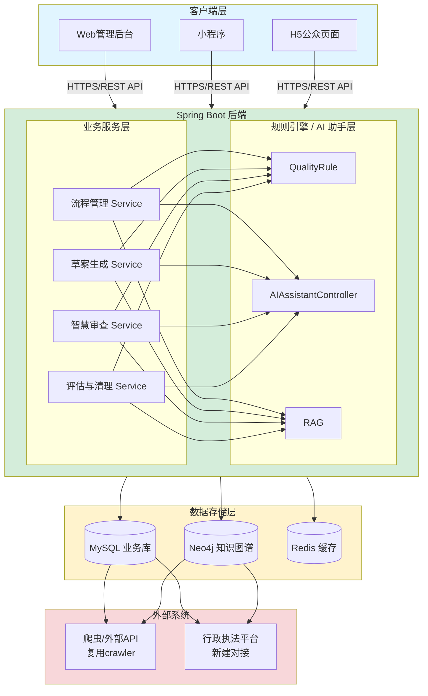
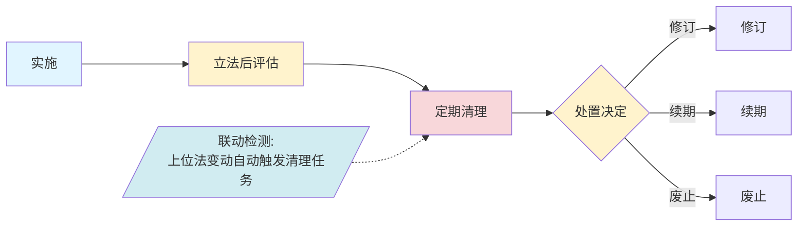
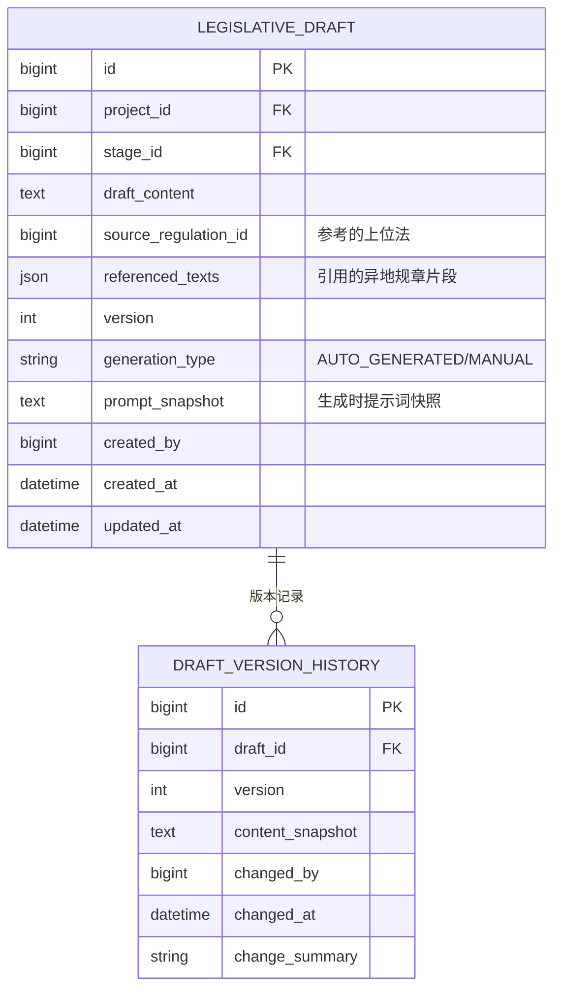
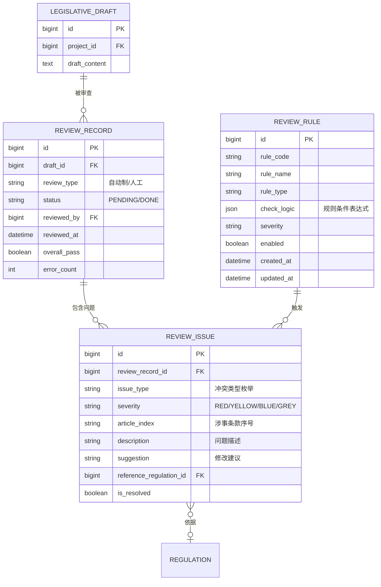
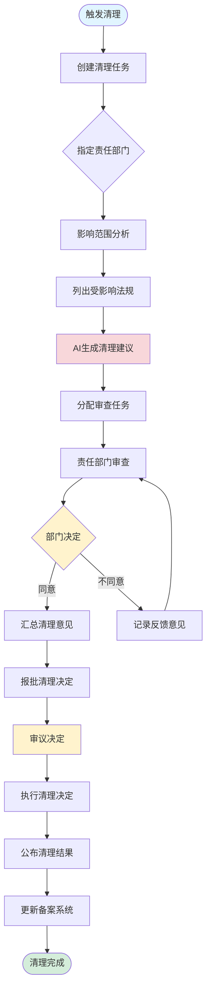
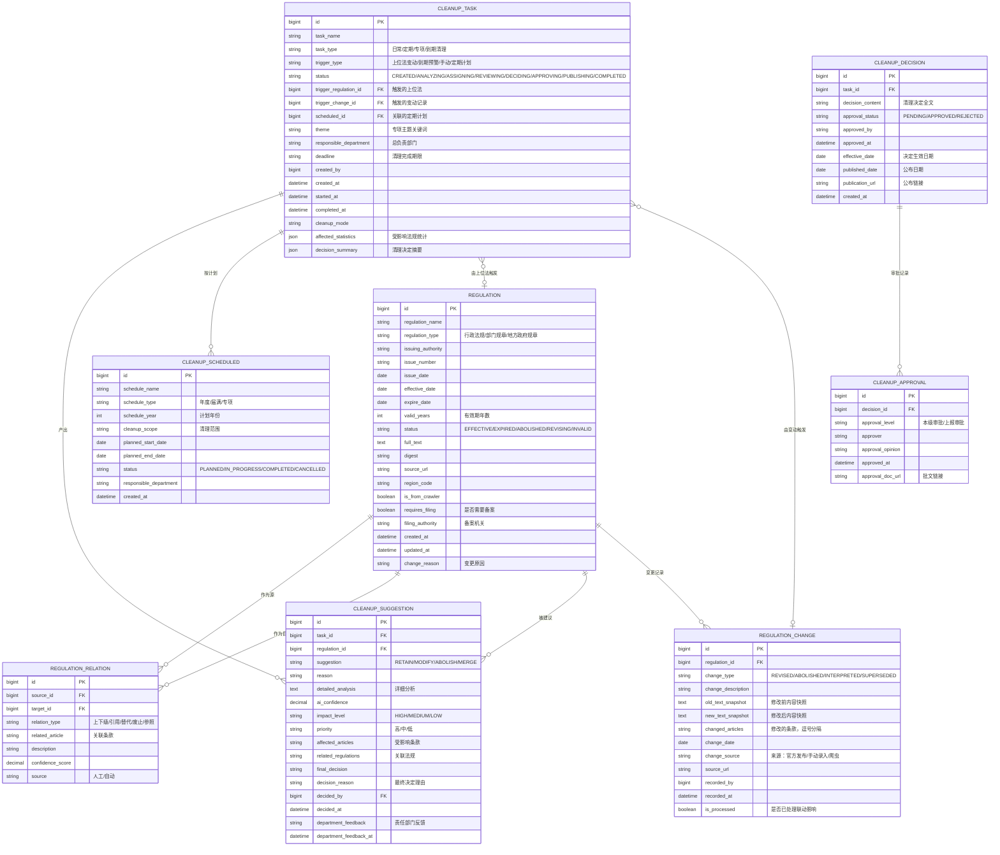
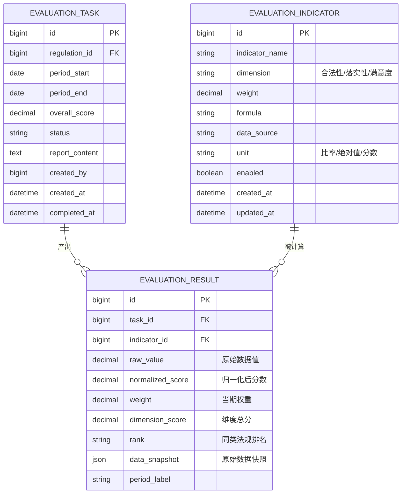
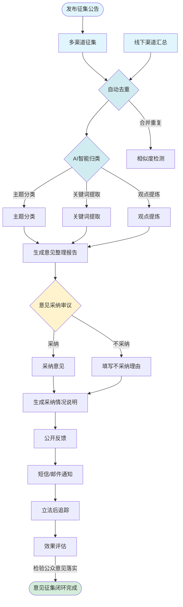

# 行政立法智能辅助平台

> **适用范围**：行政法规、部门规章、地方政府规章的立项、起草、审查、公布、清理、评估全生命周期管理。
>
> **两条程序法规依据**：
> - 《行政法规制定程序条例》→ 适用行政法规
> - 《规章制定程序条例》→ 适用部门规章 + 地方政府规章
>
> **版本**：v0.2（需求完善版）

---

## 一、背景与目标

### 1.1 现存痛点

| 痛点 | 现状 | 期望 |
|------|------|------|
| 各部门立法进度不透明，容易漏环节、耽误时间 | 大多线下推进 | 全流程线上可视 |
| 立法材料分散，不易查找复用 | 纸质/各人电脑 | 集中资料库 + 快速检索 |
| 法规到期清理依赖人工，容易遗漏 | 人工记忆 | 自动到期预警 |
| 草案编写耗时耗力，参考难找 | 靠个人积累 | AI 辅助生成 + 异地参考 |
| 人工审核负担重，标准不统一 | 各人理解不同 | 规则引擎 + AI 辅助审查 |
| 法律文件数量多，清理效率低 | 靠人工排查关联 | 自动理清上下级 + 联动提醒 |
| 评估靠问卷开会，主观成分大 | 缺真实数据 | 对接执法数据，客观评估 |
| 征求意见渠道少，群众参与感弱 | 渠道单一、反馈不足 | 多渠道 + 自动归类 + 批量回复 |

### 1.2 总体目标

建设一套覆盖"**立项 → 起草 → 审查 → 公布 → 清理 → 评估**"全生命周期的行政立法智能辅助平台，实现：

- 立法项目全流程线上管理 + 到期自动提醒
- 法规资料库 + 上下位法关系图谱
- AI 辅助草案生成 + 智慧审查
- 多渠道公众意见征集 + 自动归类反馈
- 法规实施效果多维评估

---

## 二、系统总体架构



---

## 三、功能模块详细设计

---

### 模块一：行政立法项目全流程管理

#### 3.1.1 模块概述

实现立法项目的立项、起草、审查、公布全流程线上管理。平台记录项目所处流程节点，把控各环节时间，自动提醒即将到期或需要清理的法规；显示各节点需要操作的事项，支持线上办理。

#### 3.1.2 核心子功能

| 子功能 | 说明 |
|--------|------|
| 立法项目创建 | 新建立法项目，关联类型（行政法规 / 部门规章 / 地方政府规章），自动初始化流程节点 |
| 流程节点管理 | 显示当前节点 + 历史节点，每个节点记录操作人、操作时间、备注 |
| 期限预警 | 定时扫描即将到期节点，发送系统消息 / 微信 / 邮件提醒 |
| 节点操作 | 各节点支持"提交""退回""加签""中止"等操作 |
| 关联法规 | 项目可关联多条关联法规，区分"被制定依据"和"需清理关联" |
| 进度总览 | 全部项目按状态（草稿 / 进行中 / 已发布 / 已废止）分类统计 |

#### 3.1.3 业务流程（行政法规版）

> 依据：《行政法规制定程序条例》（国务院令第321号）


**各阶段详细节点**：

| 阶段 | 节点 | 法规依据 | 操作事项 | 期限 |
|------|------|----------|----------|------|
| **立项** | 3.1.3.1 立项建议 | 条例第7条 | 提出立法动议、填写立项申请表 | — |
| | 3.1.3.2 立项论证 | 条例第8条 | 必要性/可行性/预期效果论证 | — |
| | 3.1.3.3 成本效益分析 | 国务院要求 | 立法成本与社会经济效益分析 | — |
| | 3.1.3.4 公平竞争审查 | 国发〔2016〕34号 | 涉及市场主体的一致性审查 | — |
| | 3.1.3.5 立项审查 | 条例第8条 | 法制机构审核、纳入立法工作计划 | 30日 |
| **起草** | 3.1.3.6 成立起草小组 | 条例第9条 | 确定起草人员、制定起草计划 | — |
| | 3.1.3.7 调查研究 | 条例第10条 | 调研报告、问题梳理 | — |
| | 3.1.3.8 起草草案 | 条例第11条 | 撰写法规草案正文 | — |
| | 3.1.3.9 起草说明 | 条例第11条 | 说明背景/问题/制度设计 | — |
| | 3.1.3.10 部门会签 | 条例第11条 | 涉及其他部门职责的会签 | 15日 |
| | 3.1.3.11 公平竞争审查（复核） | 国发〔2016〕34号 | 起草完成后复核 | — |
| | 3.1.3.12 报送审查 | 条例第12条 | 报送法制机构审查 | — |
| **审查** | 3.1.3.13 法制机构审查 | 条例第13条 | 形式审查、发送征求意见 | — |
| | 3.1.3.14 征求意见 | 条例第14条 | 向社会公布/书面征求意见 | 30日 |
| | 3.1.3.15 调研座谈 | 条例第14条 | 实地调研、座谈会 | — |
| | 3.1.3.16 专家论证 | 条例第14条 | 重大问题专家论证 | — |
| | 3.1.3.17 社会稳定风险评估 | 中办发〔2010〕25号 | 重大利益调整风险评估 | — |
| | 3.1.3.18 部门协调 | 条例第15条 | 协调分歧、修改完善 | 30日 |
| | 3.1.3.19 形成审查报告 | 条例第16条 | 法制机构出具审查报告 | — |
| **审议** | 3.1.3.20 报请审议 | 条例第17条 | 报送国务院审议 | — |
| | 3.1.3.21 审议决定 | 条例第18条 | 国务院常务会议审议 | — |
| | 3.1.3.22 修改通过 | 条例第18条 | 根据审议意见修改 | — |
| **公布** | 3.1.3.23 签发公布 | 条例第21条 | 总理签署国务院令 | — |
| | 3.1.3.24 公报刊登 | 条例第22条 | 国务院公报刊登 | — |
| | 3.1.3.25 备案 | 条例第23条 | 向全国人大常委会备案 | 30日 |
| | 3.1.3.26 政策解读 | 国务院要求 | 发布配套政策解读文件 | 与公布同步 |

#### 3.1.4 业务流程（部门规章版）

> 依据：《规章制定程序条例》（国务院令第709号）


**各部门规章/地方政府规章详细节点**：

| 阶段 | 节点 | 法规依据 | 操作事项 | 期限 |
|------|------|----------|----------|------|
| **立项** | 3.1.4.1 立项建议 | 条例第9条 | 提出立法动议、填写立项申请表 | — |
| | 3.1.4.2 立项论证 | 条例第10条 | 必要性/可行性论证报告 | — |
| | 3.1.4.3 公平竞争审查 | 国发〔2016〕34号 | 涉及市场主体的一致性审查 | — |
| | 3.1.4.4 立项审查 | 条例第10条 | 法制机构审核 | 30日 |
| **起草** | 3.1.4.5 成立起草组 | 条例第11条 | 确定起草人员 | — |
| | 3.1.4.6 调查研究 | 条例第12条 | 调研报告 | — |
| | 3.1.4.7 起草规章 | 条例第13条 | 撰写规章草案 | — |
| | 3.1.4.8 起草说明 | 条例第13条 | 说明制定依据/背景/问题 | — |
| | 3.1.4.9 部门会签 | 条例第13条 | 涉及其他部门会签 | 15日 |
| | 3.1.4.10 报送审查 | 条例第14条 | 报送法制机构 | — |
| **审查** | 3.1.4.11 法制机构审查 | 条例第15条 | 形式审查 | — |
| | 3.1.4.12 征求意见 | 条例第16条 | 公布征求意见 | 30日 |
| | 3.1.4.13 调研座谈 | 条例第16条 | 实地调研 | — |
| | 3.1.4.14 专家论证 | 条例第16条 | 重大问题论证 | — |
| | 3.1.4.15 社会稳定风险评估 | 中办发〔2010〕25号 | 风险评估报告 | — |
| | 3.1.4.16 协调分歧 | 条例第17条 | 协调部门分歧 | 30日 |
| | 3.1.4.17 形成审查报告 | 条例第18条 | 出具审查报告 | — |
| **审议** | 3.1.4.18 报请审议 | 条例第19条 | 报送会议审议 | — |
| | 3.1.4.19 审议决定 | 条例第20条 | 会议审议决定 | — |
| **公布** | 3.1.4.20 签发公布 | 条例第24条 | 首长签署令 | — |
| | 3.1.4.21 公报刊登 | 条例第25条 | 本级公报刊登 | — |
| | 3.1.4.22 备案 | 条例第26条 | 向相应机关备案 | 30日 |
| | 3.1.4.23 政策解读 | 国务院要求 | 配套解读文件 | 与公布同步 |

> **两类流程的差异说明**：
> 1. 行政法规：多"社会稳定风险评估"环节；审议为国务院常务会议
> 2. 部门规章/地方政府规章：审议为本部门/本级政府常务会议
> 3. 地方政府规章（较大的市）：还需向省级人大常委会备案
>
> **流程模板配置**：两个流程的节点差异通过配置表 `legislative_stage_template` 管理，模板按 `project_type`（行政法规/部门规章/地方政府规章）区分，由流程模板引擎实例化。

> **流程节点时限汇总**：

| 节点类型 | 期限 | 法规依据 |
|----------|------|----------|
| 立项审查 | 30日 | 条例第8条/第10条 |
| 部门会签 | 15日 | 条例第11条/第13条 |
| 征求意见 | 30日 | 条例第14条/第16条 |
| 部门协调 | 30日 | 条例第15条/第17条 |
| 备案 | 30日 | 条例第23条/第26条 |

#### 3.1.5 业务流程（立法后管理）

> 法规公布实施后的全生命周期管理



| 阶段 | 节点 | 说明 |
|------|------|------|
| **实施** | 实施跟踪 | 法规施行后的实施情况监控 |
| | 实施报告 | 部门提交年度实施情况报告 |
| **评估** | 实施1年评估 | 法规施行满1年进行首次评估 |
| | 定期评估 | 每年/每2年定期评估 |
| | 届满评估 | 法规5年有效期届满前评估 |
| **清理** | 日常清理 | 随时进行的即时清理 |
| | 定期清理 | 年度集中清理 |
| | 专项清理 | 按主题/领域的专项清理 |
| **处置** | 继续有效 | 评估后继续有效 |
| | 修订 | 需要修改后继续有效 |
| | 废止 | 宣布废止或自然失效 |
| | 续期 | 延长有效期 |

#### 3.1.5 阶段状态枚举

| 阶段代码 | 阶段名称 | 状态枚举 |
|----------|----------|----------|
| `PROPOSAL` | 立项建议 | `PENDING/IN_REVIEW/APPROVED/REJECTED` |
| `PROPOSAL_REVIEW` | 立项审查 | `PENDING/IN_REVIEW/APPROVED/REJECTED` |
| `DRAFTING` | 起草 | `NOT_STARTED/IN_PROGRESS/REVIEW_PENDING` |
| `PUBLIC_COMMENT` | 征求意见 | `NOT_STARTED/IN_PROGRESS/COMPLETED` |
| `EXPERT_REVIEW` | 专家论证 | `NOT_STARTED/IN_PROGRESS/COMPLETED` |
| `LEGAL_REVIEW` | 法制机构审查 | `PENDING/IN_REVIEW/APPROVED/REJECTED/RETURNED` |
| `RISK_ASSESSMENT` | 风险评估 | `NOT_STARTED/IN_PROGRESS/COMPLETED` |
| `DELIBERATION` | 审议 | `PENDING/IN_PROGRESS/APPROVED/REJECTED` |
| `PUBLICATION` | 公布 | `NOT_STARTED/IN_PROGRESS/PUBLISHED` |
| `FILING` | 备案 | `NOT_STARTED/IN_PROGRESS/FILED` |
| `POST_EVALUATION` | 立法后评估 | `NOT_STARTED/IN_PROGRESS/COMPLETED` |
| `CLEANUP` | 清理 | `NOT_STARTED/IN_PROGRESS/COMPLETED` |

#### 3.1.6 节点操作枚举

| 操作类型 | 操作代码 | 适用状态 | 说明 |
|----------|----------|----------|------|
| 提交 | `SUBMIT` | `PENDING` | 提交到下一节点 |
| 退回 | `RETURN` | `IN_PROGRESS` | 退回上一节点 |
| 驳回 | `REJECT` | `IN_REVIEW` | 驳回申请 |
| 加签 | `COSIGN` | `IN_PROGRESS` | 添加会签 |
| 协办 | `ASSIST` | `IN_PROGRESS` | 指定协办部门 |
| 中止 | `SUSPEND` | `IN_PROGRESS` | 中止流程 |
| 终止 | `TERMINATE` | `IN_PROGRESS` | 终止项目 |
| 恢复 | `RESUME` | `SUSPENDED` | 恢复流程 |
| 延期 | `EXTEND` | `IN_PROGRESS` | 申请延期 |
| 跳过 | `SKIP` | `PENDING` | 跳过非必要节点 |

#### 3.1.7 API 草图

| 方法 | 路径 | 描述 |
|------|------|------|
| GET | `/api/legislative-project/list` | 分页查询立法项目列表 |
| GET | `/api/legislative-project/{id}` | 获取项目详情（含节点链） |
| POST | `/api/legislative-project` | 新建立法项目 |
| PUT | `/api/legislative-project/{id}` | 更新项目信息 |
| DELETE | `/api/legislative-project/{id}` | 删除项目（仅草稿态） |
| GET | `/api/legislative-project/{id}/stages` | 获取项目流程节点链 |
| POST | `/api/legislative-project/{id}/advance` | 推进到下一节点 |
| POST | `/api/legislative-project/{id}/rollback` | 回退到指定节点 |
| POST | `/api/legislative-project/{id}/operate` | 执行节点操作（提交/退回/加签等） |
| GET | `/api/legislative-project/{id}/deadlines` | 获取该项目下所有期限节点 |
| GET | `/api/legislative-project/dashboard` | 仪表盘统计（各状态数量） |
| GET | `/api/legislative-project/upcoming` | 即将到期项目列表 |
| POST | `/api/legislative-project/{id}/link-regulation` | 关联已有法规到本项目 |
| DELETE | `/api/legislative-project/{id}/link-regulation/{regulationId}` | 解除关联 |
| GET | `/api/stage-template/list?type={行政法规\|部门规章\|地方政府规章}` | 获取流程模板配置 |
| POST | `/api/legislative-project/{id}/documents` | 上传节点附件材料 |
| GET | `/api/legislative-project/{id}/documents` | 获取项目附件列表 |
| POST | `/api/legislative-project/{id}/fairness-check` | 提交公平竞争审查 |
| GET | `/api/legislative-project/{id}/fairness-check/{checkId}` | 获取公平竞争审查结果 |
| POST | `/api/legislative-project/{id}/risk-assessment` | 提交社会稳定风险评估 |
| GET | `/api/legislative-project/{id}/risk-assessment/{assessmentId}` | 获取风险评估结果 |
| GET | `/api/legislative-project/{id}/timeline` | 获取项目时间轴视图 |
| POST | `/api/legislative-project/{id}/extend-deadline` | 申请节点延期 |
| GET | `/api/legislative-project/plan/{planYear}` | 获取年度立法工作计划下的项目 |

#### 3.1.8 ER 草图（完善版）

```mermaid
erDiagram
    LEGISLATIVE_PROJECT ||--o{ LEGISLATIVE_STAGE : "拥有"
    LEGISLATIVE_PROJECT ||--o{ LEGISLATIVE_DEADLINE : "拥有"
    LEGISLATIVE_PROJECT ||--o{ LEGISLATIVE_DRAFT : "产生"
    LEGISLATIVE_PROJECT ||--o{ PROJECT_DOCUMENT : "附件"
    LEGISLATIVE_PROJECT ||--o{ FAIRNESS_CHECK : "公平竞争审查"
    LEGISLATIVE_PROJECT ||--o{ RISK_ASSESSMENT : "社会稳定风险评估"
    LEGISLATIVE_PROJECT ||o--|| LEGISLATION_PLAN : "属于"
    LEGISLATIVE_PROJECT  }o--|| LEGISLATIVE_STAGE_TEMPLATE : "依据"

    LEGISLATIVE_PROJECT {
        bigint id PK
        string  project_name
        string  project_type "行政法规/部门规章/地方政府规章"
        string  description
        string  status "DRAFT/IN_PROGRESS/PUBLISHED/ARCHIVED/TERMINATED"
        bigint  plan_id FK "关联年度立法工作计划"
        string  priority "HIGH/MEDIUM/LOW"
        string  coordinating_departments "涉及协调的部门，逗号分隔"
        string  risk_level "高/中/低"
        string  fair_competition_result "通过/不通过/需调整"
        date    expected_start_date
        date    expected_end_date
        date    actual_start_date
        date    actual_end_date
        bigint  created_by
        datetime created_at
        datetime updated_at
        date    publish_date
        string  issuing_authority
        string  document_number "文号"
        boolean is_deleted
    }

    LEGISLATIVE_STAGE {
        bigint  id PK
        bigint  project_id FK
        string  stage_code
        string  stage_name
        int     stage_order
        string  status "NOT_STARTED/PENDING/IN_PROGRESS/DONE/RETURNED/SKIPPED"
        string  legal_basis "该节点对应的法规条款依据"
        json    required_documents "该节点需提交的材料清单"
        int     default_days "法定期限天数"
        date    planned_start_date
        date    planned_end_date
        date    actual_start_date
        date    actual_end_date
        bigint  operator_id
        datetime operator_time
        string  remark
        string  previous_stage_result "上一节点审批结论"
        json    approvalOpinion "审批意见快照"
    }

    LEGISLATIVE_DEADLINE {
        bigint  id PK
        bigint  project_id FK
        string  stage_code "关联节点"
        string  node_name
        date    deadline_date
        int     remind_before_days
        string  status "PENDING/REMINDED/EXTENDED/EXPIRED"
        datetime reminded_at
        string  deadline_type "法定/计划/展期"
        bigint  extended_from "展期来源ID"
    }

    LEGISLATIVE_DRAFT {
        bigint  id PK
        bigint  project_id FK
        bigint  stage_id FK
        text    draft_content
        int     version
        bigint  created_by
        datetime created_at
        datetime updated_at
    }

    LEGISLATIVE_STAGE_TEMPLATE {
        bigint  id PK
        string  type "行政法规/部门规章/地方政府规章"
        string  stage_code
        string  stage_name
        int     stage_order
        int     default_days
        boolean is_required
        string  legal_basis "法规依据条款"
        json    required_documents "节点需提交材料"
        string  allowed_operations "允许的操作列表"
        string  auto_trigger "自动触发条件"
    }

    PROJECT_DOCUMENT {
        bigint  id PK
        bigint  project_id FK
        string  stage_code "所属节点"
        string  document_type "立项建议书/论证报告/成本效益分析/征求意见稿/起草说明/审查报告..."
        string  document_name
        string  file_url
        string  file_size
        int     version
        bigint  uploaded_by
        datetime uploaded_at
        string  status "有效/作废"
    }

    FAIRNESS_CHECK {
        bigint  id PK
        bigint  project_id FK
        string  check_type "起草前/起草后/审查中"
        string  status "PENDING/IN_PROGRESS/PASSED/FAILED/NEED_MODIFY"
        text    check_report "审查报告"
        json    check_items "审查项目明细"
        json    affected_parties "受影响经营主体"
        string  conclusion "结论"
        bigint  checked_by
        datetime checked_at
        text    suggestions "修改建议"
    }

    RISK_ASSESSMENT {
        bigint  id PK
        bigint  project_id FK
        string  risk_level "高/中/低"
        string  risk_type "社会稳定/公共安全/财政风险..."
        json    risk_factors "风险因素列表"
        json    risk_mitigation "风险 Mitigation 措施"
        text    assessment_report "评估报告"
        string  responsible_department
        bigint  assessed_by
        datetime assessed_at
        string  status "PENDING/APPROVED/REJECTED"
    }

    LEGISLATION_PLAN {
        bigint  id PK
        int     plan_year
        string  plan_type "年度立法工作计划/立法规划"
        string  title
        string  priority "一类/二类/三类"
        string  proposer
        date    proposed_date
        string  approved_by
        date    approved_date
        string  status "DRAFT/APPROVED/PUBLISHED/ARCHIVED"
        text    remarks
        datetime created_at
    }

---

### 模块二：行政立法自动生成

#### 3.2.1 模块概述

对于执行上位法需要细化的事项，平台可根据上位法内容，结合其他地区类似的地方政府规章内容，生成立法草案，供立法者参考。

#### 3.2.2 核心子功能

| 子功能 | 说明 |
|--------|------|
| 上位法解析 | 解析用户指定的上位法条款，提取"需要细化的事项"清单 |
| 异地参考检索 | 根据事项类型，检索其他地区已发布的类似规章片段 |
| 草案生成 | AI 综合上位法要求 + 异地参考，生成立法草案章节 |
| 版本管理 | 同一项目可多次生成，每次生成产生新版本，支持版本对比 |
| 人工修订 | 生成后支持在线编辑，系统记录修订 diff |
| 模板填充 | 提供标准立法格式模板（章节 / 条 / 款 / 项），生成内容自动填充 |

#### 3.2.3 AI 流水线设计

```mermaid
flowchart LR
    Input[/用户输入：<br/>上位法条款/需要细化的事项/]
    Input --> Extract[事项提取<br/>LLM]
    Extract --> Items[/需要细化的事项清单/]

    Items --> RAG{RAG检索}
    RAG -->|检索| Vector[(法规资料库<br/>异地参考规章)]

    Items --> Gen[草案生成<br/>LLM]
    Vector --> Gen
    Gen --> Draft[/立法草案<br/>含：上位法要求+<br/>异地参考+<br/>立法格式规范/]

    Draft --> Check{格式校验}
    Check -->|规则引擎| Rules[检查条文格式<br/>序号、引用规范]
    Rules --> Output[/输出：<br/>立法草案文本+<br/>版本记录/]

    style Input fill:#e1f5ff
    style Items fill:#fff3cd
    style Vector fill:#d1ecf1
    style Draft fill:#fff3cd
    style Output fill:#d4edda
```

#### 3.2.4 API 草图

| 方法 | 路径 | 描述 |
|------|------|------|
| POST | `/api/draft/generate` | 生成立法草案（AI 任务，返回 taskId） |
| GET | `/api/draft/generate/result/{taskId}` | 查询生成结果 |
| GET | `/api/draft/list?projectId={id}` | 获取某项目的所有草案版本 |
| GET | `/api/draft/{id}` | 获取指定版本详情 |
| PUT | `/api/draft/{id}` | 人工修订草案内容 |
| GET | `/api/draft/{id}/compare/{otherId}` | 草案版本对比（diff） |
| GET | `/api/draft/regulation-analysis?regulationId={id}` | 解析法规中需细化的事项 |
| GET | `/api/draft/similar?keyword={kw}&region={region}` | 检索异地参考规章片段 |

#### 3.2.5 ER 草图



---

### 模块三：行政立法智慧审查

#### 3.3.1 模块概述

上传立法草案，系统自动做初步检查：条文是否与其他法律重复；内容是否符合上位法；形式上是否符合立法规范。当发现与上位法冲突、越权立法、引用已失效法条、语句冗杂等问题时，给出修改建议。

#### 3.3.2 核心子功能

| 子功能 | 说明 |
|--------|------|
| 条文重复检测 | 与法规资料库已有条文做相似度比对，标注重复率 |
| 上位法合规检查 | 检查草案条款是否与上位法冲突或越权 |
| 失效法条检测 | 检查引用法条是否已被废止或修改 |
| 形式规范检查 | 条文序号、引用格式、语言规范性（冗杂/歧义）|
| 修改建议生成 | 对每个问题给出具体条文级别的修改建议 |
| 审查历史 | 每次审查形成记录，支持版本间审查结果对比 |

#### 3.3.3 冲突类型与规则

| 规则类型 | 触发条件 | 处理方式 |
|----------|----------|----------|
| 上位法冲突 | 草案条款与上位法实质性矛盾 | 标红 + 提示"违反上位法第 X 条" |
| 越权立法 | 草案设定了超出制定权限的内容 | 标红 + 提示"超越法定权限" |
| 引用失效法条 | 引用的法条已被废止或修改 | 标黄 + 提示"该条已失效/修改" |
| 条文重复 | 与本文件或其他文件高度相似 | 标黄 + 列出相似条文来源 |
| 格式不规范 | 条文序号跳跃、引用格式错误 | 标蓝 + 给出正确格式示例 |
| 语言冗杂 | 单条超过 N 字或含套话 | 标灰 + AI 精简建议 |

#### 3.3.4 API 草图

| 方法 | 路径 | 描述 |
|------|------|------|
| POST | `/api/review/submit` | 提交草案审查（返回 taskId） |
| GET | `/api/review/result/{taskId}` | 获取审查结果（含问题列表） |
| GET | `/api/review/history?draftId={id}` | 获取某草案的审查历史 |
| GET | `/api/review/rule-list` | 获取所有审查规则列表 |
| POST | `/api/review/rule` | 新增自定义审查规则 |
| PUT | `/api/review/rule/{id}` | 更新审查规则 |
| DELETE | `/api/review/rule/{id}` | 删除审查规则 |
| GET | `/api/review/conflict-types` | 获取冲突类型统计 |

#### 3.3.5 ER 草图



---

### 模块四：行政立法智能清理

#### 3.4.1 模块概述

建立法规资料库，自动理清上下级法律、同级文件和法条引用关系。一旦上级法律修改或废止，系统自动提醒相关下级文件需要核查。支持日常清理、定期集中清理、专项主题清理，自动给出保留、修改、废止的建议清单。

> **法律依据**：《行政法规制定程序条例》第52条、《规章制定程序条例》第36条
> 行政法规、规章，应当根据立法法规定，定期清理。

#### 3.4.2 清理触发机制矩阵

| 触发类型 | 触发条件 | 触发方式 | 优先级 |
|----------|----------|----------|--------|
| **上位法变动触发** | 上位法被修改/废止/解释 | 系统自动扫描 + 手动录入 | 高 |
| | 上位法条款被修订 | 系统自动检测 | 高 |
| | 立法解释/常委会决定 | 手动录入 | 高 |
| **定期扫描触发** | 法规施行满3年 | 定时任务自动扫描 | 中 |
| | 法规施行满5年 | 定时任务自动扫描 | 中 |
| | 年度集中清理 | 定时任务年度执行 | 中 |
| **手动触发** | 部门申请清理 | 用户手动创建 | 低 |
| | 专项清理（按主题） | 用户手动创建 | 低 |
| **到期预警触发** | 法规有效期届满前6个月 | 定时任务扫描 | 中 |
| | 法规有效期届满 | 自动创建清理任务 | 高 |

#### 3.4.3 清理工作流



#### 3.4.4 核心子功能

| 子功能 | 说明 |
|--------|------|
| 法规资料库 | 集中存储行政法规、部门规章、地方政府规章全文 |
| 上下级关系建模 | Neo4j 图谱：法规 → 依据 → 上位法；法规 → 下位 → 细化的子法规 |
| 引用关系提取 | 自动从法条正文中提取引用关系，构链 |
| 变动联动检测 | 上位法变更后，自动找出所有依赖它的下级法规 |
| 多模式清理任务 | 支持三种模式：日常（随时）/ 定期（年度）/ 专项（主题）|
| 清理建议生成 | AI 根据影响范围、修改幅度、历史使用情况，给出"保留 / 修改 / 废止"建议 |
| 影响范围分析 | 展示所有受影响法规的数量、层级分布、法条引用情况 |
| 清理清单导出 | 支持导出 Excel / Word 格式的清理清单 |
| 清理结果报批 | 清理结果报送相应机关审批 |
| 清理决定公布 | 清理决定向社会公布 |
| 备案系统更新 | 清理结果更新至备案系统 |

#### 3.4.5 清理建议生成规则

| 建议类型 | 触发条件 | AI评估因素 | 说明依据 |
|----------|----------|------------|----------|
| **保留** | 上位法未实质修改 | 影响程度：轻微 | 继续有效 |
| | 内容与上位法一致 | 历史使用：正常 | 继续有效 |
| **修改** | 上位法条款被修订 | 影响程度：中等 | 需要配套修订 |
| | 制度设计不合理 | 社会反馈：较多意见 | 修改后继续有效 |
| | 存在执行问题 | 执法数据：问题较多 | 修改完善 |
| **废止** | 上位法被废止 | 影响程度：完全覆盖 | 宣布废止 |
| | 内容已被替代 | 历史使用：极少使用 | 自然失效或宣布废止 |
| | 明显过时 | 评估结果：不适应现实 | 建议废止 |

#### 3.4.6 清理结果处理流程

| 处置方式 | 处理程序 | 公布方式 |
|----------|----------|----------|
| **保留** | 登记备案 | 更新法规状态为"有效" |
| **修改** | 启动立法修订程序 → 新建立法项目 | 修改决定公布 + 新版法规公布 |
| **废止** | 报批 → 发布废止决定 | 废止决定公布 + 更新备案系统 |
| **合并** | 启动合并立法程序 | 合并决定公布 + 新版法规公布 |
| **失效** | 标注失效日期 | 更新法规状态为"已失效" |

#### 3.4.7 API 草图（完善版）

| 方法 | 路径 | 描述 |
|------|------|------|
| GET | `/api/regulation/list` | 分页查询法规列表 |
| GET | `/api/regulation/{id}` | 获取法规详情（含全文） |
| POST | `/api/regulation` | 新增法规条目 |
| PUT | `/api/regulation/{id}` | 更新法规内容 |
| DELETE | `/api/regulation/{id}` | 删除（标记废止）|
| GET | `/api/regulation/{id}/relations` | 获取本法规的上下级关系（图谱数据）|
| GET | `/api/regulation/graph?rootId={id}&depth={n}` | 获取子图（限深度） |
| GET | `/api/regulation/search?keyword={kw}` | 全文检索法规 |
| POST | `/api/regulation/{id}/mark-obsolete` | 标记法规已废止/失效 |
| POST | `/api/regulation/{id}/mark-expired` | 标记法规自然失效 |
| GET | `/api/regulation/{id}/impact-analysis` | 分析本法规变更对下级法规的影响 |
| POST | `/api/regulation/{id}/track-change` | 录入法规变动（修改/废止/解释）|
| GET | `/api/cleanup/task/list` | 获取清理任务列表 |
| POST | `/api/cleanup/task` | 创建清理任务（日常/定期/专项）|
| GET | `/api/cleanup/task/{id}` | 获取清理任务详情 |
| GET | `/api/cleanup/task/{id}/affected-regulations` | 获取任务关联的受影响法规 |
| POST | `/api/cleanup/task/{id}/suggest` | AI 生成清理建议 |
| GET | `/api/cleanup/task/{id}/report` | 导出清理报告（Excel）|
| PUT | `/api/cleanup/task/{id}/status` | 更新任务状态（进行中/已完成）|
| POST | `/api/cleanup/task/{id}/assign` | 分配清理审查任务给部门 |
| POST | `/api/cleanup/task/{id}/decision` | 提交清理决定 |
| POST | `/api/cleanup/task/{id}/submit-approval` | 报批清理决定 |
| POST | `/api/cleanup/task/{id}/publish` | 公布清理结果 |
| GET | `/api/cleanup/task/{id}/approval-status` | 获取报批状态 |
| POST | `/api/cleanup/task/{id}/sync-filing` | 同步更新备案系统 |
| GET | `/api/cleanup/scheduled/list` | 获取定期清理计划列表 |
| POST | `/api/cleanup/scheduled` | 创建定期清理计划 |
| PUT | `/api/cleanup/scheduled/{id}` | 更新定期清理计划 |
| GET | `/api/cleanup/statistics` | 获取清理统计（年度/类型分布）|
| GET | `/api/cleanup/effect-report` | 生成清理效果评估报告 |

#### 3.4.8 ER 草图（完善版）



---

### 模块五：行政立法智能评估

#### 3.5.1 模块概述

对接行政执法平台的数据，从合法性、落实性、满意度等多个角度，评估法规实施效果。用图表直观展示评估结果，自动生成评估报告。

#### 3.5.2 核心子功能

| 子功能 | 说明 |
|--------|------|
| 数据对接 | 从行政执法平台定期拉取执法量、处罚量、复议量、诉讼量 |
| 评估维度 | 合法性（执法合规率）/ 落实性（执行到位率）/ 满意度（问卷 + 投诉）|
| 评估模型 | 预设权重模型 + 支持自定义权重配置 |
| 趋势分析 | 支持多期对比（月/季/年），ECharts 折线图 + 雷达图 |
| 自动报告 | AI 生成文字版评估报告（摘要 + 分维度结论 + 建议）|
| 指标配置 | 评估指标可增删改，指标含权重、计算公式、数据来源 |

#### 3.5.3 API 草图

| 方法 | 路径 | 描述 |
|------|------|------|
| GET | `/api/evaluation/list` | 获取评估任务列表 |
| POST | `/api/evaluation` | 创建评估任务（选法规 + 选时间段）|
| GET | `/api/evaluation/{id}` | 获取评估结果详情 |
| GET | `/api/evaluation/{id}/chart-data` | 获取 ECharts 图表数据 |
| GET | `/api/evaluation/{id}/report` | 获取 AI 生成的文字报告 |
| GET | `/api/evaluation/{id}/compare/{otherId}` | 两期评估结果对比 |
| GET | `/api/evaluation/indicator-list` | 获取评估指标列表 |
| POST | `/api/evaluation/indicator` | 新增评估指标 |
| PUT | `/api/evaluation/indicator/{id}` | 更新指标（含权重）|
| DELETE | `/api/evaluation/indicator/{id}` | 删除指标 |
| POST | `/api/evaluation/data-sync` | 手动触发从执法平台同步数据 |
| GET | `/api/evaluation/indicator/{id}/history` | 指标历史分值曲线 |

#### 3.5.4 ER 草图



---

### 模块六：行政立法意见征集

#### 3.6.1 模块概述

通过网页、小程序等渠道，面向社会收集大家对立法草案、法规清理方案的意见。收集后系统自动去重、归类，提炼主要关心问题，批量整理回复，方便与公众沟通。

> **法律依据**：《立法法》第36条、《规章制定程序条例》第16条
> 法规、规章在起草过程中，应当征求意见，并将征求意见的情况向社会公布。

#### 3.6.2 征集渠道矩阵

| 渠道类型 | 渠道名称 | 适用场景 | 功能特性 |
|----------|----------|----------|----------|
| **线上渠道** | Web管理后台 | 内部工作人员使用 | 征集发布、意见管理 |
| | H5公众页面 | 面向公众 | 意见提交、查询进度 |
| | 微信小程序 | 移动端公众 | 扫码提交、消息推送 |
| | 政务APP | 政务用户 | 意见提交、消息提醒 |
| | 人大官网 | 对接人大网站 | 同步征集公告 |
| **线下渠道** | 立法基层联系点 | 基层征求意见 | 代表提交、批量录入 |
| | 座谈会 | 重点领域征集 | 会议记录、代表意见 |
| | 书面征集 | 部门/单位征集 | 纸质意见电子化 |
| | 来信来访 | 传统渠道 | 手工录入系统 |

> **多渠道联动**：同一征集活动可同时启用多个渠道，系统自动汇总、去重。

#### 3.6.3 意见征集闭环机制



#### 3.6.4 核心子功能

| 子功能 | 说明 |
|--------|------|
| 征集发布 | 在 Web / 小程序 / 政务APP / 人大官网发布征集公告，关联立法草案或清理方案 |
| 多渠道汇总 | 同时支持线上（Web/H5/小程序/政务APP）和线下（联系点/座谈会/书面）渠道 |
| 意见提交 | 匿名/实名提交，支持文字 + 附件（图片/文档），支持上传证据材料 |
| 自动去重 | 基于文本相似度（SimHash / embedding）去重，标记重复意见来源 |
| 智能归类 | AI 将意见按主题分类（法规适用范围 / 处罚力度 / 程序设计 / 法律责任等）|
| 关键词提取 | 统计高频关键词，生成词云，识别热点问题 |
| 观点统计 | 各类别的支持 / 反对 / 中立比例，可视化展示 |
| 意见采纳审议 | 工作人员对意见逐条审议，标注采纳/不采纳，填写理由 |
| 采纳情况说明 | 对采纳/不采纳的意见生成说明文档 |
| 公开反馈 | 将意见采纳情况向社会公开（符合政府信息公开要求） |
| 回复管理 | 批量给同类意见生成统一回复模板，逐一发送通知 |
| 征集统计 | 参与人次 / 意见总数 / 去重后数量 / 分类分布 / 采纳率 |
| 征集工作总结 | 生成意见征集工作总结报告，提交审议 |
| 效果追踪 | 在立法后评估时，检验是否落实了公众主要意见 |

#### 3.6.5 意见分类体系

| 一级分类 | 二级分类 | 说明 |
|----------|----------|------|
| 合法性意见 | 与上位法冲突 | 违反上位法规定 |
| | 超越权限 | 设定无权设定的事项 |
| | 违反程序 | 制定程序违法 |
| 合理性意见 | 制度设计不合理 | 制度安排不当 |
| | 处罚力度不当 | 处罚过重或过轻 |
| | 范围过宽/过窄 | 调整对象范围不当 |
| 可行性意见 | 实施条件不具备 | 条件不成熟 |
| | 执行成本过高 | 执法成本过大 |
| | 配套措施缺失 | 缺少实施细则 |
| 操作性意见 | 表述不清 | 语言模糊有歧义 |
| | 逻辑矛盾 | 条文之间矛盾 |
| | 程序繁琐 | 办事流程复杂 |
| 其他意见 | 文字表述 | 错别字、语病等 |
| | 格式规范 | 引用格式等 |
| | 建议类 | 建设性意见 |

#### 3.6.6 API 草图（完善版）

| 方法 | 路径 | 描述 |
|------|------|------|
| GET | `/api/consultation/list` | 获取征集公告列表 |
| POST | `/api/consultation` | 发布征集公告 |
| GET | `/api/consultation/{id}` | 获取征集详情 |
| PUT | `/api/consultation/{id}` | 更新征集状态（开启/截止）|
| PUT | `/api/consultation/{id}/publish` | 发布征集公告（多渠道）|
| POST | `/api/consultation/{id}/opinion` | 公众提交意见 |
| POST | `/api/consultation/{id}/opinion/batch` | 批量导入意见（线下渠道）|
| GET | `/api/consultation/{id}/opinions` | 获取意见列表（含分类标签）|
| GET | `/api/consultation/{id}/statistics` | 获取统计（去重后数量/分类分布/词云数据）|
| POST | `/api/consultation/{id}/classify` | AI 批量归类意见（后台任务）|
| POST | `/api/consultation/{id}/dedup` | 触发去重（后台任务）|
| POST | `/api/consultation/{id}/keyword` | 提取关键词并生成词云 |
| GET | `/api/consultation/{id}/report` | 生成意见整理报告 |
| POST | `/api/consultation/{id}/opinion/{opinionId}/adopt` | 标记意见为采纳 |
| POST | `/api/consultation/{id}/opinion/{opinionId}/reject` | 标记意见为不采纳，填写理由 |
| POST | `/api/consultation/{id}/adoption-report` | 生成采纳情况说明文档 |
| POST | `/api/consultation/{id}/reply-batch` | 批量提交回复 |
| POST | `/api/consultation/{id}/notify` | 向提交者发送回复通知 |
| GET | `/api/consultation/{id}/feedback` | 获取公开反馈数据 |
| POST | `/api/consultation/{id}/feedback/publish` | 发布公开反馈 |
| POST | `/api/consultation/{id}/summary` | 生成征集工作总结报告 |
| GET | `/api/consultation/opinion/{opinionId}` | 获取单条意见详情 |
| GET | `/api/consultation/{id}/channels` | 获取各渠道意见分布统计 |
| POST | `/api/consultation/{id}/export` | 导出意见数据（Excel/Word）|
| GET | `/api/consultation/category/list` | 获取意见分类体系 |
| POST | `/api/consultation/category` | 新增自定义分类 |

#### 3.6.7 ER 草图（完善版）

```mermaid
erDiagram
    CONSULTATION     ||--o{ OPINION           : "征集"
    CONSULTATION     ||--o{ OPINION_CATEGORY  : "分类"
    CONSULTATION     ||--o{ CONSULTATION_CHANNEL : "征集渠道"
    CONSULTATION     ||--o{ ADOPTION_REPORT   : "采纳情况说明"
    CONSULTATION     ||--o{ FEEDBACK_PUBLISH  : "公开反馈"
    OPINION          ||--o{ OPINION           : "回复引用"
    OPINION          ||--o{ OPINION_REPLY     : "回复"
    OPINION          }o--|| OPINION_CATEGORY  : "归类"
    ADOPTION_REPORT  ||--o{ ADOPTION_ITEM     : "采纳项"

    CONSULTATION {
        bigint  id PK
        string  title
        string  description
        bigint  related_project_id FK
        bigint  related_draft_id FK
        bigint  related_cleanup_task_id FK
        string  status "DRAFT/PUBLISHED/CLOSED/ARCHIVED"
        date    start_date
        date    end_date
        int     total_views
        int     total_opinions
        int     deduped_count "去重后意见数"
        decimal adoption_rate "采纳率"
        string  channels "已启用的渠道，逗号分隔"
        boolean is_public_feedback "是否已公开反馈"
        bigint  created_by
        datetime created_at
        datetime updated_at
        datetime closed_at
    }

    CONSULTATION_CHANNEL {
        bigint  id PK
        bigint  consultation_id FK
        string  channel_type "WEB/H5/MINI_APP/GOV_APP/LEGISLATIVE_CONTACT_POINT/MEETING/PAPER"
        string  channel_name
        string  external_url "外部渠道URL（如需对接）"
        boolean enabled
        int     opinion_count "该渠道收到的意见数"
        datetime created_at
    }

    OPINION {
        bigint  id PK
        bigint  consultation_id FK
        bigint  parent_id FK "回复上级意见"
        string  submitter_name
        string  submitter_type "自然人/法人/社会组织"
        string  submitter_contact
        string  submitter_region
        text    content
        json    attachment_urls
        string  similarity_hash "去重用"
        bigint  dedup_source_id "去重来源ID，null表示原创"
        string  status "NEW/PROCESSED/ADOPTED/REJECTED/REPLIED"
        datetime submitted_at
        string  classified_category
        string  category_path "分类路径，如：合法性意见/超越权限"
        decimal ai_category_confidence
        string  viewpoint "支持/反对/中立"
        json    keywords "提取的关键词"
        boolean is_anonymous
        bigint  processed_by
        datetime processed_at
        string  processing_remark "处理备注"
        string  source_channel "意见来源渠道"
    }

    OPINION_REPLY {
        bigint  id PK
        bigint  opinion_id FK
        text    reply_content
        string  reply_type "采纳说明/不采纳理由/一般回复"
        bigint  reply_by FK
        datetime reply_at
        boolean notify_sent
        string  notify_method "短信/邮件/站内"
    }

    OPINION_CATEGORY {
        bigint id PK
        bigint consultation_id FK
        string category_name
        string parent_category "上级分类"
        string category_path "分类路径"
        int    opinion_count
        int    support_count
        int    oppose_count
        int    neutral_count
        decimal proportion "占比"
    }

    ADOPTION_REPORT {
        bigint  id PK
        bigint  consultation_id FK
        string  report_title
        text    report_content
        int     total_opinions
        int     adopted_count
        int     rejected_count
        string  approval_status "PENDING/APPROVED/PUBLISHED"
        bigint  approved_by
        datetime approved_at
        datetime published_at
        datetime created_at
    }

    ADOPTION_ITEM {
        bigint  id PK
        bigint  report_id FK
        bigint  opinion_id FK
        string  decision "ADOPTED/REJECTED"
        text    reason "采纳/不采纳理由"
        string  related_article "关联条款"
    }

    FEEDBACK_PUBLISH {
        bigint  id PK
        bigint  consultation_id FK
        string  publish_content
        string  publish_platform "WEB/MINI_APP/GOV_APP"
        boolean is_published
        datetime published_at
        string  publish_url "已发布内容的链接"
        bigint  published_by
    }

---

### 模块七：立法资料管理

#### 3.7.1 模块概述

搭建立法资料库，统一存放法律法规、历史草案、调研报告、专家意见、案例材料等。支持关键词快速检索，方便起草、审核人员随时调取、查阅、利用立法资料。

#### 3.7.2 核心子功能

| 子功能 | 说明 |
|--------|------|
| 资料分类存储 | 区分：法规原文 / 历史草案 / 调研报告 / 专家意见 / 案例材料 |
| 标签管理 | 多标签体系（领域 / 层级 / 地区 / 关键词）|
| 全文检索 | MySQL 全文索引 + Elasticsearch 扩展 |
| 收藏与笔记 | 个人收藏 + 在线批注笔记 |
| 关联推荐 | 查看法规时，自动推荐关联的上下级法规 / 类似法规 / 历史草案 |
| 资料版本 | 同一条目支持多版本，保留修改历史 |
| 批量导入 | 支持 Excel / Word 批量导入元数据 |

#### 3.7.3 API 草图

| 方法 | 路径 | 描述 |
|------|------|------|
| GET | `/api/library/material/list` | 分页查询资料列表 |
| POST | `/api/library/material` | 上传资料元数据 |
| PUT | `/api/library/material/{id}` | 更新资料信息 |
| DELETE | `/api/library/material/{id}` | 删除资料 |
| GET | `/api/library/material/{id}` | 获取资料详情 |
| GET | `/api/library/material/search?keyword={kw}` | 全文检索 |
| POST | `/api/library/material/{id}/favorite` | 收藏资料 |
| DELETE | `/api/library/material/{id}/favorite` | 取消收藏 |
| GET | `/api/library/material/favorites` | 我的收藏列表 |
| POST | `/api/library/material/{id}/note` | 添加批注 |
| GET | `/api/library/material/{id}/notes` | 获取批注列表 |
| GET | `/api/library/material/{id}/related` | 获取关联推荐 |
| POST | `/api/library/material/batch-import` | 批量导入 |
| GET | `/api/library/tag/list` | 获取标签列表 |
| POST | `/api/library/tag` | 新增标签 |

#### 3.7.4 ER 草图

```mermaid
erDiagram
    LIBRARY_MATERIAL ||--o{ MATERIAL_TAG  : "拥有"
    LIBRARY_TAG      ||--o{ MATERIAL_TAG  : "被关联"
    LIBRARY_MATERIAL ||--o{ MATERIAL_NOTE : "包含"

    LIBRARY_MATERIAL {
        bigint  id PK
        string  title
        string  material_type "REGULATION/DRAFT/REPORT/EXPERT_OPINION/CASE"
        string  region_code
        string  issuing_authority
        date    issue_date
        date    effective_date
        json    keywords
        string  file_url
        text    digest
        text    full_text
        int     reference_count
        int     view_count
        bigint  created_by
        datetime created_at
        datetime updated_at
    }

    LIBRARY_TAG {
        bigint id PK
        string tag_name
        string tag_type "领域/层级/地区"
        int    usage_count
    }

    MATERIAL_TAG {
        bigint material_id FK
        bigint tag_id      FK
    }

    MATERIAL_NOTE {
        bigint  id PK
        bigint  material_id FK
        bigint  user_id     FK
        text    note_content
        string  highlighted_text
        datetime created_at
    }
```

---

### 模块八：立法信息展示

#### 3.8.1 模块概述

整合各地各级人大近年来的立法规划、各级政府近年来年度立法工作计划，领导讲话、中央政策法规及地方法规文件、政报公报、立法研究、参考学术文献等内容，搭建服务于政府立法参阅知识辅助平台。

#### 3.8.2 核心子功能

| 子功能 | 说明 |
|--------|------|
| 立法动态聚合 | 展示最新立法动态（来源：政府官网 / 人大网 / 政报）|
| 法规文件库 | 按层级（中央/省级/市级）× 类型（法规/规章/规范性文件）分类展示 |
| 政策解读 | 重要法规配套的政策解读、领导讲话 |
| 学术参考 | 立法研究论文、学术文献摘要（可对接知网/万方）|
| 数据大屏 | 立法数量统计 / 地区分布 / 领域分布的可视化大屏 |
| 智能推荐 | 基于当前浏览内容，推荐相关法规、文献、动态 |
| 订阅推送 | 订阅特定领域/地区的立法动态，定期推送 |

#### 3.8.3 API 草图

| 方法 | 路径 | 描述 |
|------|------|------|
| GET | `/api/info/news` | 最新立法动态列表 |
| GET | `/api/info/news/{id}` | 动态详情 |
| GET | `/api/info/regulation-index` | 法规索引（多维度筛选）|
| GET | `/api/info/policy-interpretations` | 政策解读列表 |
| GET | `/api/info/academic-literature` | 学术文献列表 |
| GET | `/api/info/bulletin` | 政报公报列表 |
| GET | `/api/info/dashboard` | 大屏数据（统计数字）|
| GET | `/api/info/dashboard/chart` | 大屏图表数据 |
| POST | `/api/info/subscription` | 订阅领域/地区动态 |
| DELETE | `/api/info/subscription/{id}` | 取消订阅 |
| GET | `/api/info/subscription/list` | 我的订阅列表 |
| GET | `/api/info/recommend?materialId={id}` | 相关推荐 |

---

## 四、跨模块共享设计

### 4.1 用户与权限

| 角色 | 说明 |
|------|------|
| 系统管理员 | 全部权限 |
| 立法管理员 | 负责立法项目、清理任务的创建和分配 |
| 审查员 | 使用智慧审查模块 |
| 评估员 | 使用评估模块 |
| 公众用户 | 提交意见（意见征集模块） |

> **复用**：`government_edition` 已有 `sys_user` 表、RBAC 权限体系，直接扩展角色即可。

### 4.2 消息通知（复用）

| 通知类型 | 来源模块 | 推送渠道 |
|----------|----------|----------|
| 项目到期提醒 | 模块一 | 系统消息 / 微信 / 邮件 |
| 草案生成完成 | 模块二 | 系统消息 |
| 审查结果通知 | 模块三 | 系统消息 |
| 法规变动联动 | 模块四 | 系统消息 / 微信 |
| 评估报告生成 | 模块五 | 系统消息 / 邮件 |
| 意见征集状态 | 模块六 | 系统消息 / 短信 |
| 订阅动态推送 | 模块八 | 微信 / 邮件 |

> **复用**：`government_edition` 的 `MessagePush`、`CrossDeptMessage`、`AssetDeadlineWarning`、`DeadlineReminderTask` 机制，仅需扩展消息模板。

### 4.3 知识图谱（复用）

| 图谱 | 节点类型 | 关系类型 | 所在模块 |
|------|----------|----------|----------|
| 法规上下级关系 | Regulation | 上位/下位/替代/引用 | 模块四 |
| 法条引用关系 | Article | 引用/被引用 | 模块三/四 |
| 项目-法规关联 | Project ↔ Regulation | 制定依据/需核查 | 模块一/四 |

> **复用**：`government_edition` 的 `Neo4j + graph/` 包 + `KnowledgeGraphService`，新建 `RegulationGraphService` 扩展。

### 4.4 规则引擎（复用）

| 规则类型 | 所在模块 | 配置方式 |
|----------|----------|----------|
| 审查规则（冲突/越权/失效）| 模块三 | `review_rule` 表 |
| 清理建议规则 | 模块四 | `cleanup_rule` 表 |
| 评估指标权重 | 模块五 | `evaluation_indicator` 表 |

> **复用**：`government_edition` 的 `QualityRule`、`RuleController`，扩展规则类型枚举。

### 4.5 AI 助手集成（复用）

| AI 任务 | 触发方式 | 所在模块 |
|----------|----------|----------|
| 草案生成（RAG + LLM）| 模块二主动触发 | 模块二 |
| 审查冲突检测 | 模块三主动触发 | 模块三 |
| 清理建议生成 | 模块四定时触发 | 模块四 |
| 评估报告生成 | 模块五定时触发 | 模块五 |
| 意见智能归类 | 模块六提交后触发 | 模块六 |

> **复用**：`government_edition` 的 `AIAssistantController`、`AiScoreController`，为每类任务定义 `TaskType` 枚举。

---

## 五、模块优先级与实施路线图

### 第一期（优先落地）

| 优先级 | 模块 | 理由 |
|--------|------|------|
| P0 | 模块一（流程管理） | 最基础，先跑通全流程 |
| P0 | 模块七（资料管理） | 法规资料库是其他所有模块的数据基础 |
| P1 | 模块四（智能清理） | 联动检测是亮点，且复用程度最高 |
| P1 | 模块八（信息展示） | 对外展示，需求明确 |
| P2 | 模块三（智慧审查） | 规则引擎复用，AI 审查 |
| P2 | 模块二（自动生成） | 需 RAG + LLM，准备时间较长 |
| P3 | 模块五（智能评估） | 需对接外部执法数据，依赖期长 |
| P3 | 模块六（意见征集） | 公众渠道独立性强，可后期接入 |

### 第二期

- 对接行政执法平台数据（模块五数据源）
- 小程序端完善意见征集（模块六）
- 完善法规知识图谱可视化和智能推荐

---

## 六、技术实现摘要

### 6.1 复用资产清单

| 资产 | 路径 | 复用方式 |
|------|------|----------|
| Spring Boot 后端框架 | `government_edition/backend/` | 复制到 `legislation_edition/backend/` |
| Vue3 前端框架 | `government_edition/web_frontend/` | 复制到 `legislation_edition/web_frontend/` |
| 微信小程序 | `government_edition/miniprogram/` | 复制到 `legislation_edition/miniprogram/` |
| MyBatis-Plus 配置 | `government_edition/backend/src/main/java/.../config/` | 直接复用 |
| JWT 认证 | `government_edition/backend/src/main/java/.../config/SecurityConfig.java` | 直接复用 |
| 消息推送 | `government_edition/backend/.../MessagePush*.java` | 直接复用 |
| 定时任务 | `government_edition/backend/.../DeadlineReminderTask.java` | 复制并扩展 |
| 知识图谱 | `government_edition/backend/.../graph/` | 新建 `RegulationGraphService` 扩展 |
| 规则引擎 | `government_edition/backend/.../QualityRule.java` | 扩展枚举类型 |
| AI 助手 | `government_edition/backend/.../AIAssistantController.java` | 新增任务类型 |
| 文书自动生成 | `government_edition/backend/.../DocumentAutoGenerateController.java` | 扩展生成类型 |
| 爬虫数据 | `crawler/` | `legal_regulation` 等表直接复用 |

### 6.2 新建清单

| 新建内容 | 说明 |
|----------|------|
| `legislation_edition/` 目录 | 项目根目录 |
| `legislative_project / stage / deadline` 表 | 模块一数据模型 |
| `legislative_draft / draft_version_history` 表 | 模块二数据模型 |
| `review_record / review_issue / review_rule` 表 | 模块三数据模型 |
| `regulation / regulation_relation / cleanup_task / cleanup_suggestion` 表 | 模块四数据模型 |
| `evaluation_task / evaluation_indicator / evaluation_result` 表 | 模块五数据模型 |
| `consultation / opinion / opinion_category / opinion_reply` 表 | 模块六数据模型 |
| `library_material / library_tag / material_note` 表 | 模块七数据模型 |
| `LegislativeFlowService` | 从 `CaseFlowService` 派生，新增流程模板引擎 |
| `RegulationGraphService` | 从 `KnowledgeGraphService` 派生 |
| `LegislationReviewService` | 从 `QualityRule` 扩展，新增冲突类型 |
| `CleanupTaskService` | 从 `AssetDeadlineWarning` 派生 |
| `EvaluationService` | 新建，接入执法数据 |
| `OpinionClassificationService` | 从 `AIAssistantController` 扩展 |

---

## 七、待明确事项

以下事项在正式开发前需要与需求方确认：

### 7.1 基础确认事项（高优先级）

| 序号 | 待明确事项 | 确认内容 | 建议选项 |
|-----|-----------|----------|----------|
| 1 | **执法数据对接方式** | 是 API 对接、数据库直连还是文件导入？执法平台有哪些可用字段？ | API / 数据库直连 / 文件导入 |
| 2 | **AI 模型选型** | 使用哪个大模型（通义 / 文心 / GPT）？是否需要本地部署？ | 阿里通义 / 百度文心 / OpenAI / 本地部署 |
| 3 | **行政法规 vs 规章的流程差异** | 两套流程模板具体有哪些节点不同，是否还有第三类（较大的市制定的地方政府规章）？ | 已有初步设计，待确认 |
| 4 | **意见征集的法律效力** | 是否需要与政府信息公开系统打通？ | 是 / 否 |
| 5 | **数据迁移** | 现有法规历史数据有多少，是否需要从已有系统迁移？ | 数量级估计 |
| 6 | **用户量预估** | 并发用户数、同时在线峰值，影响架构选型 | 用户数估算 |

### 7.2 公平竞争审查（高优先级）

| 序号 | 待明确事项 | 确认内容 |
|-----|-----------|----------|
| 7 | **审查主体** | 公平竞争审查由哪个部门负责？法制机构还是市场监管部门？ |
| 8 | **审查时点** | 起草前审查 vs 起草后审查，是否两次都需要？ |
| 9 | **审查标准** | 依据《公平竞争审查制度实施细则》，需要确认审查范围 |

### 7.3 社会稳定风险评估（高优先级）

| 序号 | 待明确事项 | 确认内容 |
|-----|-----------|----------|
| 10 | **评估主体** | 社会稳定风险评估由哪个部门负责？ |
| 11 | **评估标准** | 依据中办发〔2010〕25号，需要确认评估等级标准 |
| 12 | **评估时点** | 是否所有法规都需要评估，还是仅重大决策需要？ |

### 7.4 备案管理（中优先级）

| 序号 | 待明确事项 | 确认内容 |
|-----|-----------|----------|
| 13 | **备案机关** | 行政法规向全国人大常委会备案；部门规章/地方政府规章向谁备案？ |
| 14 | **备案时限** | 法规公布后30日内完成备案，是否需要系统记录？ |
| 15 | **备案系统对接** | 是否需要与全国人大备案信息系统对接？ |

### 7.5 系统对接（中优先级）

| 序号 | 待明确事项 | 确认内容 |
|-----|-----------|----------|
| 16 | **OA/公文系统对接** | 与现有 OA/公文系统的对接需求，是否需要推送立项/审议等节点到 OA？ |
| 17 | **政务服务平台对接** | 意见征集是否需要对接政务服务平台？ |
| 18 | **人大官网对接** | 征集公告是否需要同步到人大官网？ |
| 19 | **备案信息系统对接** | 清理结果是否需要同步到全国人大备案信息系统？ |

### 7.6 权限与安全（中优先级）

| 序号 | 待明确事项 | 确认内容 |
|-----|-----------|----------|
| 20 | **节点权限细化** | 各流程节点的权限控制是否需要到具体操作级别？ |
| 21 | **数据权限** | 不同层级用户（中央/省级/市级）能看到哪些法规范围？ |
| 22 | **敏感操作审计** | 是否需要对关键操作（删除/废止/退回）进行审计？ |

### 7.7 移动端与离线（中优先级）

| 序号 | 待明确事项 | 确认内容 |
|-----|-----------|----------|
| 23 | **移动端功能范围** | 是否需要离线操作功能？如现场调研时离线录入？ |
| 24 | **消息推送渠道** | 是否需要支持企业微信/钉钉消息推送？ |

### 7.8 部署与运维（低优先级）

| 序号 | 待明确事项 | 确认内容 |
|-----|-----------|----------|
| 25 | **部署模式** | 政务云/私有云/混合云？是否需要信创环境支持？ |
| 26 | **数据备份** | 是否需要跨区域备份？备份频率？ |
| 27 | **多语言支持** | 是否需要支持少数民族语言版本？ |

---

## 八、与 CaseGuardian 原项目的异同分析

### 8.1 原项目定位回顾

仓库根 `README.md` 保留着 1.0 标签《检察院文书校验与管理系统》（即 `LawyerAssistant`），但当前代码已演化成 3 条线：

| 子项目 | 业务定位 | 技术栈特征 |
|---|---|---|
| `government_edition`（政法版 / 检管家） | 律所 / 法院 / 检察院 — **案件全流程管理 + 风险预警 + 知识图谱** | Spring Boot 3 + MySQL + Redis + Neo4j + Vue3 + 小程序 |
| `university_edition`（高校版） | 法学院学生 — **学习 / 案例 / 模拟竞赛** | 同上技术栈，UI 换成 Ant Design Vue |
| `crawler` | 从最高检官网抓 **法律 / 案例 / 流程 / 文书规范** 数据 | Python 3 + requests + BeautifulSoup + MySQL |

> 原本「检察院、案件、文书校验」是 1.0 时代的标签，当前仓库已演化为「**法律 AI × 多角色**」的多版本基础平台。`crawler` 已经在做"法律/案例知识库"——这是和"立法"最接近的一块。

### 8.2 业务层面对比

| 维度 | 原项目（CaseGuardian） | 新需求（行政立法智能辅助平台） |
|---|---|---|
| **业务领域** | 司法（检察办案 / 案件流程 / 文书校验 / 高校教学） | 行政立法（行政法规、规章起草、审查、清理、评估） |
| **核心实体** | 案件、流程节点、文书、当事人、风险 | 立法项目、法规草案、上位法 / 下位法、意见反馈 |
| **业务环节重心** | 案件**办理**端（立案 → 审判 → 执行 → 归档） | 法规**生命周期**端（立项 → 起草 → 审查 → 公布 → 清理 → 评估） |
| **参与方** | 检察官、律师、学生 | 立法机关、政府部门、起草者、审查者、社会公众 |
| **目标用户角色** | 内部办案人员 + 学院师生 | 立法工作人员 + 部门 + 领导 + 社会大众 |
| **核心痛点** | 案件流程不透明、文书不规范、风险识别 | 起草难、审查难、清理难、评估难、意见散 |
| **AI 能力使用点** | NLP 文书解析、规则引擎、风险预警、知识图谱（案例关联） | NLP 草案生成 / 审查 / 冲突识别 / 法规关系图谱 |
| **数据来源** | 内部办案系统（业务库）+ 最高检官网爬虫 | 法律法规库（已有）+ 行政执法数据（要新对接）+ 公众意见 |
| **输出形态** | 案件视图、预警、统计报告、竞赛排行 | 草案、审查意见、清理清单、评估报告、信息推送 |
| **技术栈匹配** | Spring Boot + Vue3 + 小程序 + Neo4j + MySQL + 爬虫 | — **完全一致**，可直接复用底座 |

### 8.3 复用度高的资产（基本无需重建）

| 新模块需求 | 现有最接近的实现 | 复用方式 |
|---|---|---|
| （七）立法资料管理 + （八）信息展示 + 法规资料库 | `crawler/output` 已抓法律/案例/规范 + `LegalRegulation.java` + `legal_regulation` 表 + 工作规范 Neo4j 知识图谱 | 直接复用抓取的数据存储、检索逻辑、知识图谱建模 |
| （三）智慧审查的"重复 / 与上位法冲突" | `QualityRule`、`DocumentComparisonHistory`、`DocumentContradiction`、`CardFillController`（差错校对引擎） | 把"文书差错规则"扩展到"法规条款冲突规则"，规则引擎可直接复用 |
| 上下位法关系图谱 | `Neo4j + graph/` 包，`KnowledgeGraphService` | 法规 → 法条 → 引用 的图谱本质一致 |
| 全部前端 | `web_frontend`（Element Plus / Vue3）+ 小程序 | UI 框架、布局、消息推送、权限可直接复用 |
| 跨部门消息 / 推送 / 提醒 | `MessagePush`、`CrossDeptMessage`、`AssetDeadlineWarning`、`DeadlineReminderTask` | 立法项目到期提醒、清理提醒、评估推送仅替换业务实体 |
| 流程节点 + 期限管理 | `CaseFlowService`、`CaseStage`、`CaseDeadline`、`TimeLimitController` | 这是立法全流程"立项→起草→审查→公布"映射一模一样的形态 |
| AI 助手对接 | `AIAssistantController`、`AiScoreController` | 草案生成、智慧审查、评估报告生成可直接做 AI 任务 |
| 规则配置化 | `RuleController` + 可视化规则 + 条件表达式 | 审查规则、清理规则、评估指标规则走同一套规则引擎 |
| 文档版本对比 | `CaseDocumentController`（`DocumentComparisonHistory`、`CaseDocumentVersion`） | 草案版本对比、清理前后对比可复用 |
| 自动生成（草案/评估报告/合规回复） | `DocumentAutoGenerateController`、`CardFillController`（卡片填写） | 立法草案自动生成、合规回复可直接套用 |

### 8.4 需要新建的部分（业务差异点）

| 需新增 | 说明 |
|---|---|
| 立法项目主数据 | 替代"案件"，需新增 `LegislativeProject`、`LegislativeStage`、`LegislativeDeadline` |
| 法规实体 | 扩展 `LegalDocument` 为多层级（行政法规 / 部门规章 / 地方政府规章） |
| 上下位法、引用关系模型 | 在 Neo4j 中新建独立的子图，与案件图谱分开 |
| 立法"草案生成"流水线 | 模块二是全新的 AI 生成场景，需 RAG + 异地规章检索 + 提示工程 |
| "智慧审查"冲突识别 | 冲突类型：与上位法冲突 / 越权 / 引用失效法条 / 语言冗杂，是全新规则库 |
| "清理"全流程 | 日常清理 / 定期清理 / 专项清理 三种模式，需要任务编排 |
| "评估"对接行政执法数据 | 需数据治理层：从行政执法平台抓取执法量、处罚、复议、诉讼等 |
| "意见征集"渠道 | 新前端 + 自动归类 AI，可新建独立微服务 |
| 法规到期自动检测 | 跟 `CaseDeadline` 类似，但按"法律 + 行政法规 + 规章"分别管理 |
| 流程模板（元数据） | 把《行政法规制定程序条例》《规章制定程序条例》流程差异做成配置数据 |

### 8.5 异同点总结

- **业务完全不同**：从"司法办案" → "行政立法"，不是迭代升级，而是新建方向；
- **技术栈、模块形态、AI 接入方式、爬虫 / 知识图谱 / 规则引擎 / 消息提醒 / 版本对比 / 全流程前端** 等底座能力高度一致，**约 70% 的基础设施可直接复用**；
- **新文档颗粒度较粗**（原始 docx 44 行），要落地到 `PROJECT_SUMMARY.md` 级别，需要补充：每个模块的子流程、API 列表、数据表、AI 模型选型、与《行政法规制定程序条例》《规章制定程序条例》的流程映射、外部系统对接（行政执法平台、人大立法规划库）——这些已在前文模块设计中展开。

### 8.6 落地建议

1. **不新建仓库**，在 `CaseGuardian` 下新建 `legislation_edition/` 目录，沿用 `government_edition` 的 `backend/web_frontend/miniprogram` 三件套结构；
2. **优先复用**：`LegalRegulation`、Neo4j `graph`、`QualityRule`、`CaseFlowService`、`DocumentAutoGenerateController`、`crawler` 抓取能力；
3. **重点新建**：5 类新业务实体（立法项目 / 法规草案 / 上下位法关系 / 评估指标 / 公众意见）、"草案生成" AI 流水线、清理 / 评估 / 意见征集三大新工作台；
4. **先做拆分**：按文档（八）"或许可以限缩到其中一个或几个"的提示——建议先选**地方政府规章**（范围小 + 与执法数据对接最容易落地），再扩展到部门规章、行政法规；
5. **流程上**：把《行政法规制定程序条例》和《规章制定程序条例》两个流程模板做成可配置数据，再让 `CaseFlowService` 衍生出 `LegislativeFlowService`；
6. **AI 模型选型**：草案生成和审查建议建议走 RAG + LLM（异地规章库做语料），评估报告建议用 BI/图表引擎生成（已有 ECharts）。

---

*文档生成时间：2026-10-02*
*文档更新时间：2026-10-03（v0.2 完善版）*
*完善内容：流程节点补全、法律依据映射、数据模型扩展、意见征集闭环机制、清理模块细化、待明确事项补充*
*待与需求方进一步确认*
